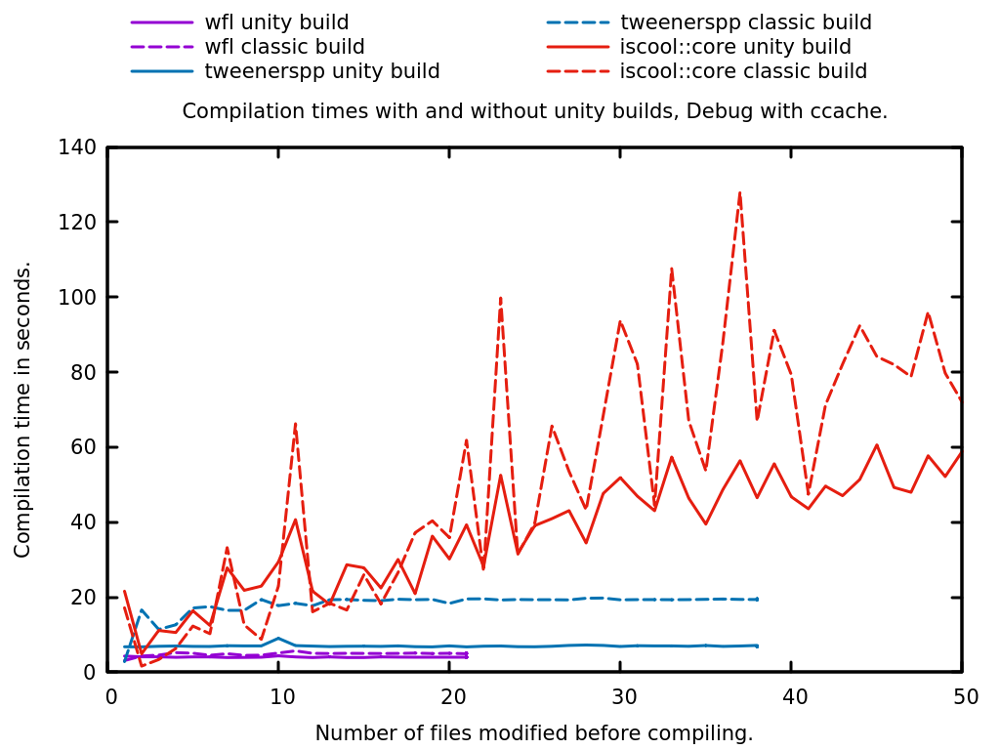
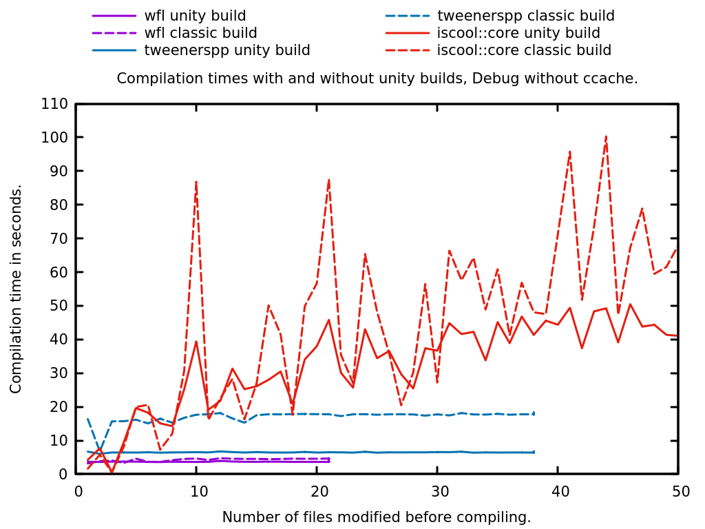
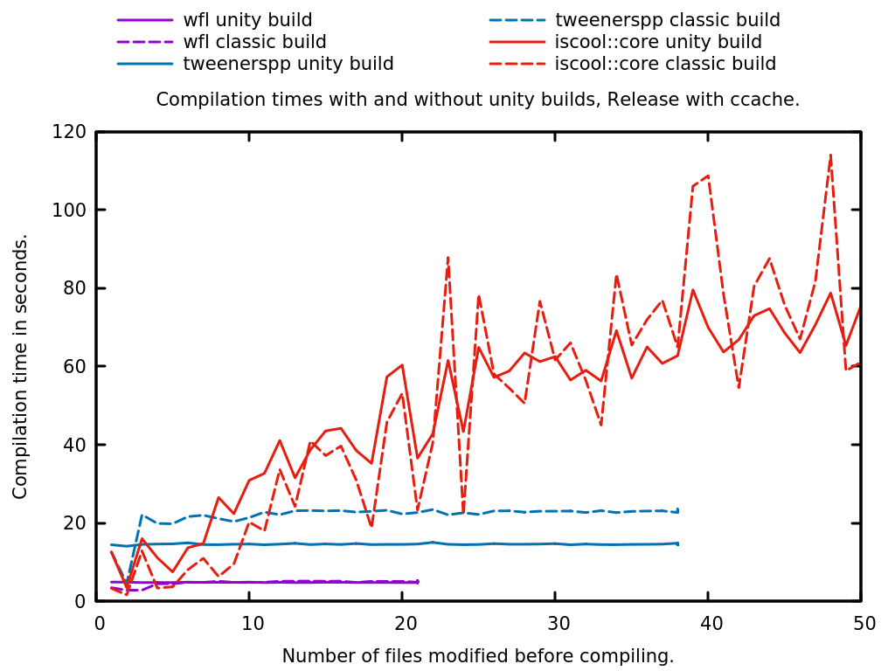
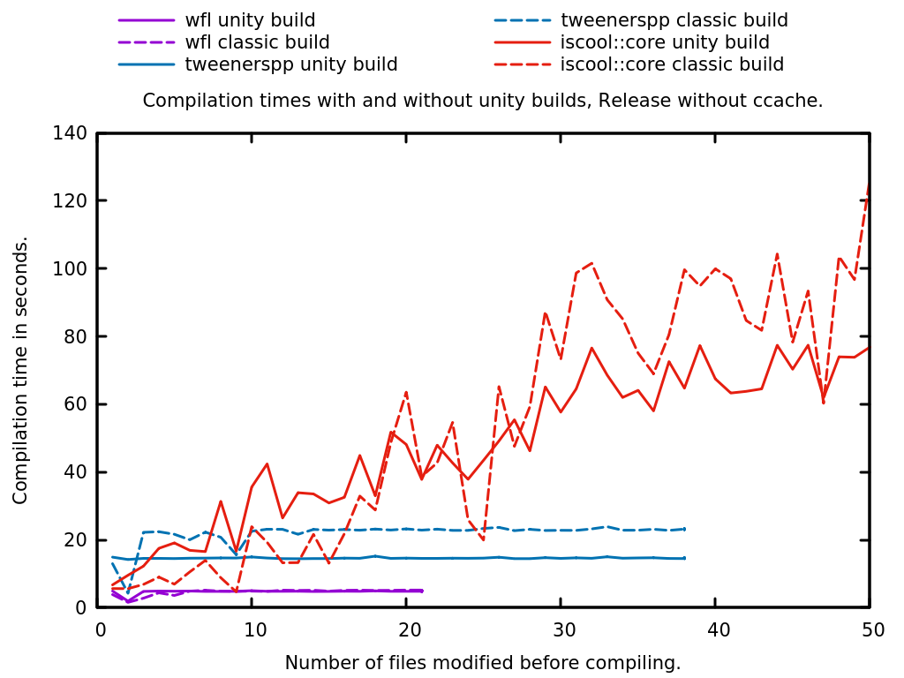
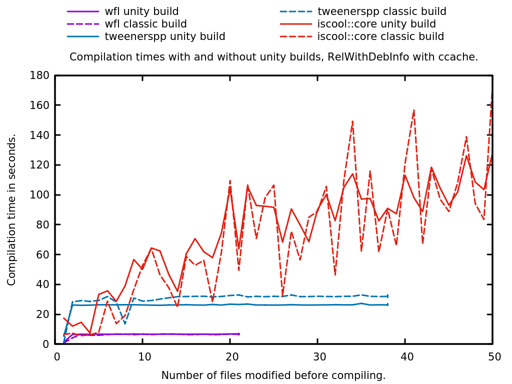
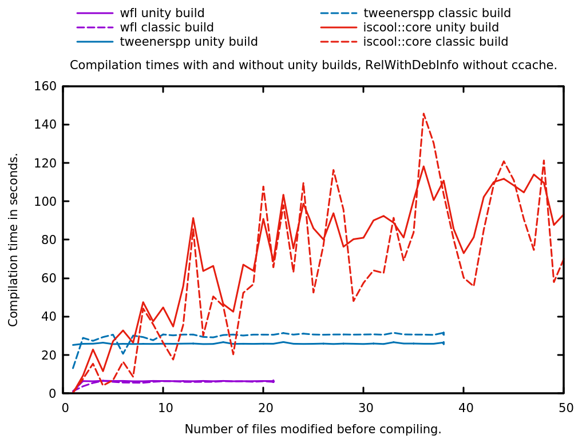

Unity builds. They exist. Use them.

- [Quick start](#quick-start)
- [What are unity builds](#what-are-unity-builds)
- [Build time comparison](#build-time-comparison)
- [What's going on under the hood](#whats-going-on-under-the-hood)
- [See also](#see-also)

# Quick start

This repository contains scripts to compare the time required to build a C++ project with and without unity builds. In order to run it on your computer, just execute

```sh
./bin/benchmark.sh
```

It will checkout three open source projects and measure how long takes their compilation for a given set of changes, with and without unity builds. For example, the output of the script on my Intel(R) Core(TM) i5-3210M CPU @ 2.50GHz with 8 Gb of RAM is:

```
# <thousands of lines>
+---------------+
|  The Results  |
+---------------+
Building with 3 modified files out of 21 in 'weak-function' took 3.97 seconds with a unity build, 3.51 seconds without.
Building with 4 modified files out of 38 in 'tweenerspp' took 7.17 seconds with a unity build, 18.12 seconds without.
Building with 101 modified files out of 1006 in 'iscool-core' took 70.37 seconds with a unity build, 154.03 seconds without.
```

# What are unity builds

The term _Unity Build_ or _Jumbo Build_ is an alternative to the classical incremental build of your C++ project where the idea is to merge multiple source files into few, typically via `#include` directives all the files from the project.

The supposed advantages are:
- Shorter compilation times when modifying several files: headers are parsed only once, so are template declarations. Think how many times your compiler has to read e.g. `<algorithm>` in your typical incremental build,
- Shorter link times: chances are that in your typical incremental build several symbols are present in many object files (hello templates), then the linker has to sort them out. Unity builds make less object files and thus reduce the load for the linker,
- Better optimizations: the compiler sees more code and has thus a better understanding of the whole program.

On the negative side, there are some caveats:
- Name clash: if you have file-scoped symbols with the same name in different files then — since all files are merged into one — they become duplicate symbol definitions.
- A similar problem occurs for `#define`d symbols not followed by an `#undef`.
- `using namespace` directives at file scope tend to propagate everywhere and will lead to ambiguous symbols.

CMake can handle these unity builds for you since version 3.16, simply by setting `CMAKE_UNITY_BUILD=ON` and `CMAKE_UNITY_BUILD_BATCH_SIZE=<large_number>`

# Build time comparison

A common misconception about unity builds is that even if they speed-up the full builds they will slow down your day to day work, where you change a few lines here and there then recompile, because these few changes will be merged in a larger compilation unit. Let's check this statement with these graphs that compare the compilation time of three projects when changing 1 to 50 files, with and without unity builds.


Debug with ccache                  | Debug without ccache
:---------------------------------:|:------------------------------------:|
 | 

Please note that the set of modified files is different for each graph but they are the same for the two curves of a given project on a given graph.

These measures have been done on debug builds. As you can see there are a few cases where the unity build is slower than the classic build, otherwise it is globally faster or equivalent. Also, and certainly most importantly, the time lost on small changes, when there is loss, is of a few seconds for an otherwise fast build, while the time gained brings minute-long builds to under the minute.

Let's have a look at the same benchmark for builds in release and in release with debug info enabled:

Release with ccache                  | Release without ccache
:-----------------------------------:|:--------------------------------------:|
 | 

RelWithDebInfo with ccache                  | RelWithDebInfoDebug without ccache
:------------------------------------------:|:----------------------------------------------:|
 | 

The curves for iscool::core show that the unity build is less often better than the incremental build, especially when few files are modified. Moreover, whether it is a debug or release build, one can observe that the time of the incremental build is very chaotic with iscool::core while the time for the unity build has far less variations. It is clearly smoother, so more predictable.

There is one specific thing to take into consideration for release builds. If you build in this mode you certainly want the most efficient machine code, and for this you would better give as many information as possible to your compiler. So unity build it is.

See also how wfl and tweenerspp are always faster to compile when the unity build is enabled. These two libraries are quite small and made of a single source set plus unit tests, contrary to iscool::core which is made of several libraries. Each library in the latter is then built with a unity build when the feature is enabled. Consequently, the results greatly vary regarding to how many libraries are impacted by the changes.

Think about how many files are compiled every time you checkout your colleagues' branches, every time you refactor some fairly used code, every time you change a comma in your `utils.h` file. Then clone this repository and check the results by yourself. You can even use the script `./bin/am-i-special.sh` to benchmark on your own projects, as long as they use CMake and Git.

# What's going on under the hood

The benchmark tries to reproduce the normal situations that trigger recompilation when a programmer works on a project, namely editing a file or importing changes from coworkers. In order to achieve this goal, the script goes through the following steps:

1. get the source of a project,
2. collect the path of N random c++ files,
3. compile the project without the unity build feature,
4. modify the N random files,
5. compile the project again, without the unity build feature,
6. revert the changes made to the source,
7. compile the project with the unity build feature,
8. modify the N random files,
9. compile the project again, with the unity build feature.

Steps 4 and 8 simulate the normal work of the programmer. In both steps the changes are minimal yet equivalent: an `extern int` variable with a unique name is added at the end of the file. The changes are the same in both steps except for the variable names.

The time measured for steps 5 and 9 is thus the actual time you would have waited if you had modified the selected files in the normal production process. These measures are reported at the end.

The builds are done with `make -j$(ncpu)` and if ccache is found it will also be used by default. Pass `--help` to the scripts to check the options.

The projects built by the scripts are:

- [tweenerspp](https://github.com/j-jorge/tweenerspp/), approximately 1000 lines of code.
- [wfl](https://github.com/j-jorge/weak-function/), approximately 3000 lines of code.
- [iscool::core](https://github.com/j-jorge/iscool-core), approximately 30,000 lines of code.

The dependencies from these projects will be downloaded, compiled and installed locally by the script if they are not available on your system. Namely, these dependencies are Gettext, JsonCpp, Googletest and Boost. The benchmark works better if the latter is available on your system. If downloaded, these dependencies are installed in a subdirectory of this repository.

Also, compiling these dependencies will slow down the first run but does not change the benchmark's output.

If you know any other open source project that uses CMake and that supports both unity builds and non-unity builds, I would be happy to add them to the benchmark.

# See also

* [Tobias Hieta: Compiling C++ is slow - let's go faster](https://www.youtube.com/watch?v=X4pyOtawqjg)
* [A guide to unity builds](https://onqtam.com/programming/2018-07-07-unity-builds/)
* [Unity build test with Meson & LibreOffice](https://nibblestew.blogspot.com/2020/02/unity-build-test-with-meson-libreoffice.html)
* [Another unity build benchmark](https://github.com/Triangle345/CppUnityBuildBenchmarks/)
* [Impact of including each standard header](https://github.com/ned14/stl-header-heft)
